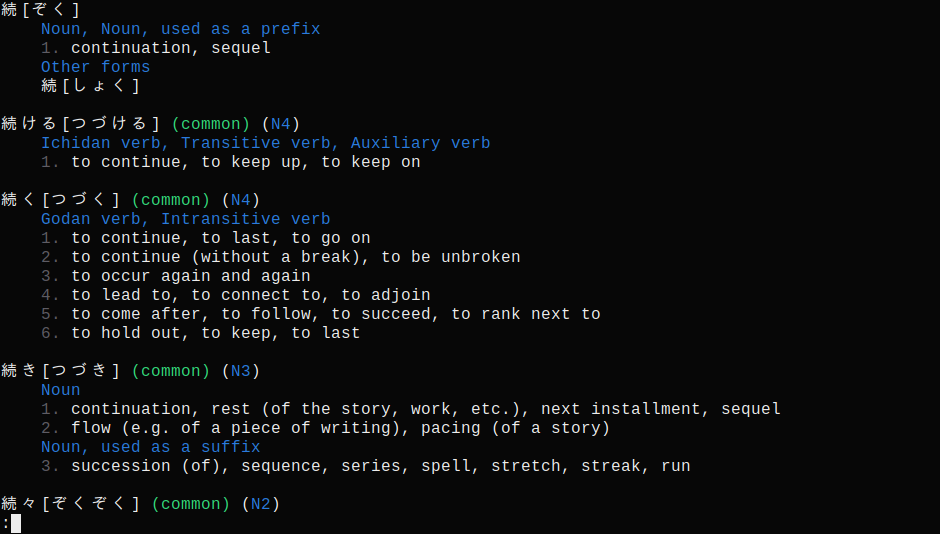
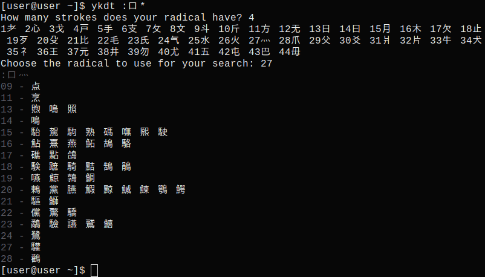
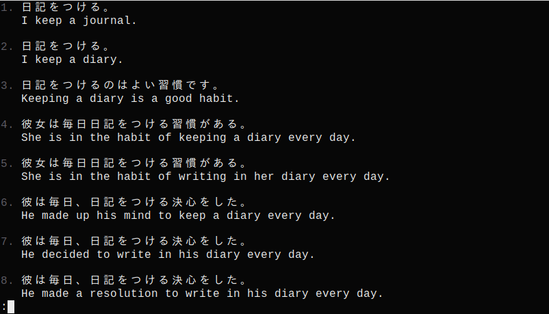

# Yakudatsu (cli)
A simple cli tool to look up Japanese words using jisho.org's API.
Additionally, searching for kanji by radicals and browsing tatoeba's database of example sentences is also available.

### Jisho dictionary 


### Searching by radicals


### Tatoeba sentences


## Installation
Binaries are directly available from the release tab.

## Compilation

Download source and run
```
make release
sudo make install
```

## Usage
A readline wrapper like `rlwrap` is strongly recommended if using `ykdt` interactively (-i or empty input).
```
ykdt [<words to look up>]
ykdt :[<radicals in kanji>]
ykdt _[<expressions in  sentences>]
```
When looking up kanji, * (or ＊) can be used to add a radical that can't be easily typed, e.g. 气.

## Sources
Dictionary definitions retrieved using [jisho](jisho.org)'s API.

To search kanji by radicals, the [radkfile](https://www.edrdg.org/krad/kradinf.html) needs to be installed in either `~/.local/share/` on Linux or `~\AppData\Local\ `on Windows.
Kanji stroke information extracted from [kanjidic2](https://www.edrdg.org/kanjidic/kanjidic2.xml.gz).

Example sentences taken from [tatoeba](https://tatoeba.org/).
